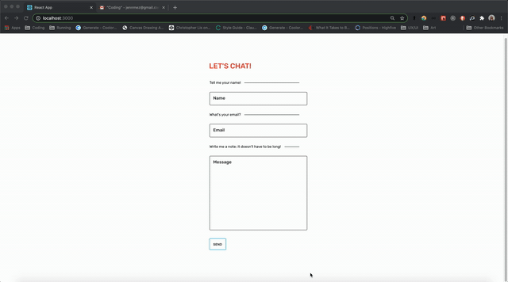

## Contact Me Form

This project was created for a user to send emails to the website's manager using the site's contact us form.

### Technologies Used:

ReactJS, Express, Nodemailer, SCSS, Axios

### How To Use:

To use the form, you can fork and clone this repository to your machine. Run npm install in your terminal to install dependencies.

Use "npm run start" to start up the server and client, or "nodemon run start" for continuous updates.

It is currently set up to send emails to GMail, so if you do not use this service, you will have to update the SMTP transport information in the app.js api routes. You can visit https://nodemailer.com/smtp/ for more information regarding set up. You'll also need to create a .env file to store your sensitive information.

### To Dos:

Responsive design for smaller screens
Animation between states
Tests using Jest!

###### This project was bootstrapped with [Create React App](https://github.com/facebook/create-react-app).
